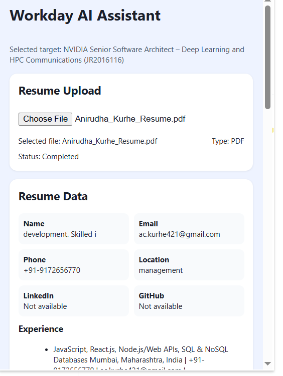

# Workday AI Job Application Automation

## Project Overview
This project is a Chrome Manifest V3 extension designed to assist with AI-powered Workday application automation while respecting the constraints of the assignment. The implementation focuses on the primary target application: NVIDIA Senior Software Architect – Deep Learning and HPC Communications (JR2016116). It was selected as the primary target because it is explicitly listed and is a representative Workday application workflow.

### Extension UI

## Problem Statement
Workday job applications contain dynamic form structures, multi-step workflows, optional questions, and conditional rendering. A candidate typically needs to re-enter resume information across multiple sections, and the process is error-prone. This extension attempts to reduce that burden by parsing a resume, identifying Workday fields, matching candidate data semantically, filling known values, validating required data, and requiring explicit user confirmation before any submission.

## Features
- Resume upload for PDF and DOCX files
- Resume parsing into structured JSON
- AI-assisted resume understanding with runtime configuration
- Semantic heuristic field matching with AI fallback
- Workday field detection using DOM inspection and semantic heuristics
- MutationObserver support for dynamic Workday rendering
- Autofill with validation and safe overwrite protection
- Multi-step navigation detection
- Question handling for yes/no and voluntary/EEO-style prompts
- Final review and explicit confirmation requirement before submit
- Secure handling of candidate data and credential configuration

## Technology Stack
- React
- TypeScript
- Vite
- Chrome Extension Manifest V3
- Chrome content scripts and service worker
- PDF.js
- Mammoth
- MutationObserver DOM automation

## Architecture
The extension is split into the required modules:
- React popup UI
- Resume parser
- AI service
- Workday field detector
- Heuristic mapper
- AI mapper
- Autofill engine
- Navigator
- Validation engine
- Background service worker
- Content script
- messaging
- review logic
- submission confirmation gate

## Folder Structure
- src/popup/
- src/content/
- src/background/
- src/parser/
- src/mapper/
- src/ai/
- src/validation/
- src/types/
- src/services/
- src/utils/
- public/

## Data Flow
1. User uploads resume in the popup UI.
2. Parser extracts raw text and normalizes structured resume data.
3. AI service can optionally enrich the parsed result if supported by configured API credentials.
4. User opens the selected Workday application page.
5. The content script detects the page, scans fields, and tracks dynamic changes.
6. The mapper associates resume data to form fields using normalized labels and AI fallback.
7. Autofill writes values only when they are missing or safe to overwrite.
8. The validation engine checks required fields and format issues.
9. User reviews results and confirms before any submit action is allowed.

## Resume Parsing Strategy
The parser accepts PDF and DOCX files, extracts text, and normalizes it into a structured resume model. It captures name, email, phone, location, experience, education, skills, certifications, and social links. Missing values remain empty rather than being fabricated.

## AI Strategy
AI is used as an optional reasoning layer around resume understanding and field mapping. API configuration is kept outside source code via environment variables. The extension validates the AI response before applying it and keeps the logic isolated to the AI service.

## Semantic Field Mapping
The mapping system first normalizes labels by lowercasing, stripping punctuation, and comparing against common synonyms. Heuristic matching is used before AI mapping. AI is applied only when the heuristic result is weak or ambiguous, and low-confidence results are marked for user attention.

## Workday Automation Strategy
The content script inspects the live DOM, identifies fields, and uses MutationObserver to handle dynamic field rendering. It tries to detect labels, placeholder text, aria attributes, assisted descriptions, neighboring text, and option metadata without depending solely on fixed selectors.

## MutationObserver Strategy
The observer monitors DOM changes and re-runs field detection when new elements are inserted. It keeps a processed field registry to avoid repeated work and prevents infinite loops during dynamic updates.

## Multi-Step Navigation
The navigator classifies Workday steps such as login, profile, experience, education, questions, review, and confirmation. It pauses automation when login is required and resumes only when the page is ready for further actions.

## Validation
The validation engine checks required fields, email format, phone length, dropdown presence, radio/checkbox states, and general completeness. It returns a validation object with valid Boolean plus errors and warnings arrays.

## Security
- No resume contents are logged to the console.
- No API keys are hardcoded in the source code.
- No authentication bypass is implemented.
- No automatic submission occurs without explicit user confirmation.
- Sensitive data is only kept in browser storage when necessary.

## Setup
1. Install dependencies with npm install.
2. Copy .env.example to .env and fill the values for your AI endpoint if needed.
3. Run npm run build to produce the extension bundle.
4. Load the dist folder in Chrome using Load unpacked.

## Environment Variables
The project includes .env.example with placeholders:
- AI_API_KEY
- AI_MODEL
- AI_API_ENDPOINT
- VITE_AI_API_KEY
- VITE_AI_MODEL
- VITE_AI_ENDPOINT

## Development
- npm install
- npm run dev
- npm run test

## Production Build
- npm run build

## Loading Extension in Chrome
1. Open Chrome and go to chrome://extensions.
2. Enable Developer Mode.
3. Choose Load unpacked.
4. Select the generated dist folder.

## Testing
Manual checks should confirm:
- resume upload
- resume parsing
- Workday detection
- dynamic field detection
- semantic mapping
- autofill
- multi-step navigation
- answer handling for questions
- validation
- final review
- explicit confirmation

## Selected Workday Application
Primary target: NVIDIA Senior Software Architect – Deep Learning and HPC Communications (JR2016116)
Alternative provided application kept as a compatible target pattern: Target ETL GM Food Sales.

## Limitations
- Real AI call execution requires a valid configured backend endpoint and API credentials.
- Workday pages are dynamic and may require browser-side adaptation beyond the generic heuristics included here.
- Some question types may require user review because the extension must not invent unsupported candidate information.
- Real Workday DOM variations may need minor tuning for a specific posting.

## Demo Flow
- Upload resume
- Parse resume data
- Open NVIDIA Workday application page
- Run automation from the popup extension
- Review mapped fields and required attention items
- Confirm final review
- Submit only after explicit user click

## Known Constraints
- No automatic submission without direct user confirmation.
- No credential bypass or authentication circumvention.
- Minimal data retention and no unnecessary logging.
- Generic DOM matching is used instead of brittle selector assumptions.
